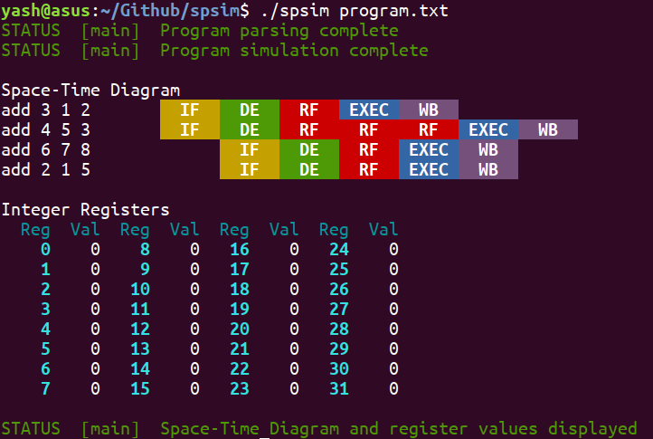
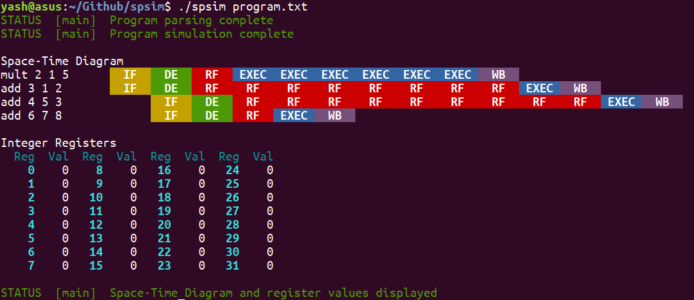

***
## Instructions
*   All changes will be made only to the `test` branch
*   Suggestions, bugs, checklists etc. will be all maintained via the **Issues** tab. Please keep on checking it for any task that might have been assigned to you.
*   After completing a task, submit a pull request to `master`. Code will be reviewed by other team members; then changes will be merged and the issue will be closed.
*   For compiling the program, just run `make`. If you have altered the code structure (added a new folder etc.) update the **Makefile** at the appropriate place.
*   Before submitting a pull request, remember to clean the archive by executing `make clean`.
***

# SPSIM - a Superscalar Processor SIMulator
This repository contatins the code of our course project for Computer Architecture (CS305-CS341) at IIT Bombay. We have developed a simulator for a superscalar processor with dynamic (out-of-order) scheduling and branch prediction in C++.




## Team
### Name
Comarchs
### Members
*   [160050002] Yash Shah ([**@ys1998**](https://github.com/ys1998))
*   [160050025] Naman Jain ([**@Naman-ntc**](https://github.com/Naman-ntc))
*   [160050032] Utkarsh Gupta ([**@Ug48**](https://github.com/Ug48))
*   [160050042] Rupesh ([**@dungeon-masterRupesh**](https://github.com/dungeon-masterRupesh))
*   [160050059] Sharvik Mital ([**@sharvik-mital**](https://github.com/sharvik-mital))

## Reference papers
*   *"The Microarchitecture of Superscalar Processors"*, James E. Smith, Gurindar S. Sohi
*   *"The MIPS R10000 Superscalar Microprocessor"*, Kenneth C. Yeager
*   *"Microarchitecture of a Coarse-Grain Out-of-Order Superscalar Processor"*, Davor Capalija, Tarek S. Abdelrahman

## Code structure
`main.cpp` contains the main simulation program. It instantiates all classes, creates the pipeline by aligning entities according to stages, maintains a global *clock* for the purpose of timing and invokes each entity at both the rising and falling clock edge.

`entities.hpp` contains a list of all forward-declared classes modeling the hardware entities used in this simulator. The definitions and method specifications can be found in the corresponding `.cpp` file in `entities/` folder.

```
details of other major files, when added, shall go here
```
