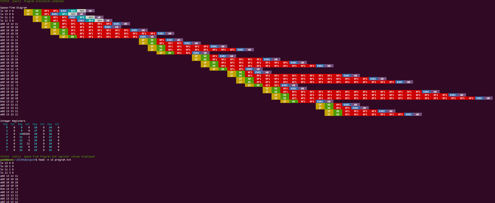

# SPSIM - a Superscalar Processor SIMulator
This repository contatins the code of our course project for Computer Architecture (CS305-CS341) at IIT Bombay. We have developed a simulator for a superscalar processor with dynamic (out-of-order) scheduling and branch prediction in C++.

## Team
### *"Comarchs"*
*   [160050002] Yash Shah ([**@ys1998**](https://github.com/ys1998))
*   [160050025] Naman Jain ([**@Naman-ntc**](https://github.com/Naman-ntc))
*   [160050032] Utkarsh Gupta ([**@Ug48**](https://github.com/Ug48))
*   [160050042] Rupesh ([**@rs9899**](https://github.com/rs9899))
*   [160050059] Sharvik Mital ([**@sharvik-mital**](https://github.com/sharvik-mital))

## Reference papers
*   *"The Microarchitecture of Superscalar Processors"*, James E. Smith, Gurindar S. Sohi
*   *"The MIPS R10000 Superscalar Microprocessor"*, Kenneth C. Yeager
*   *"Microarchitecture of a Coarse-Grain Out-of-Order Superscalar Processor"*, Davor Capalija, Tarek S. Abdelrahman

## Code structure
The entire codebase has been divided into the following parts
* `src` : Folder containing all `.cpp` files
* `inc` : Folder containing all header (`.hpp`) files
* `prog` : Folder containing sample programs for simulation
* `images` : Screenshots of sample simulations

Overview of modelling of hardware components and connections:
1.  Each clocked hardware component is modelled using an appropriate derived class of the more abstract `ClockedEntity` class. Each of these entities has a `tick()`, `tock()` and `flush()` method, which are used to perform necessary actions during the events of a rising clock edge, falling clock edge and flushing of invalid instructions respectively. The various *clocked entities* represented are as follows (**fill one-line details later**):
    *  `Fetcher`
    *  `Decoder`
    *  `Issuer`
    *  `ALU1`
    *  `ALU2`
    *  `ALU3`
    *  `MEM`
    *  `Writer`
    *  `Flusher`
2.  Apart from these clocked entities, several *static entities* were also used (**fill one-line details later**):
    *  `ICache/DCache`
    *  `Buffer`
    *  `BusyBitTable`
    *  `RegisterMapping`
    *  `FreeList`
    *  `ActiveList`
    *  `IntegerRegisterFile`
    *  `IntegerQueue`
    *  `AddressQueue`
    *  `Latch`
    *  `BranchPredict`, `BranchPredictAddr`
3.  The connections between these static and clocked components are modelled using *pointers*. When a component is instantiated, it is provided with the pointers to those entities with which it is connected - either for reading input or writing/pushing output. This datapath is generated in `main.cpp`.

## Screenshots

