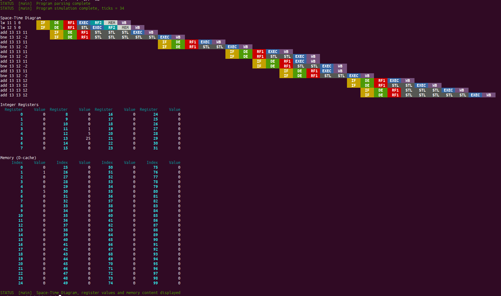
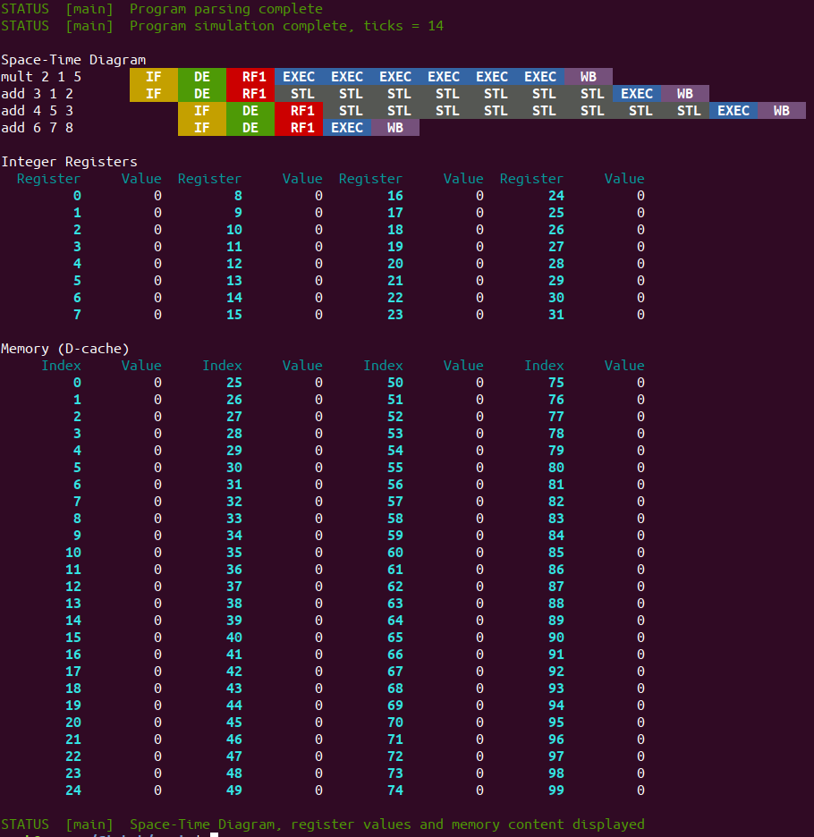

# SPSIM - a Superscalar Processor SIMulator
This repository contatins the code of our course project for Computer Architecture (CS305-CS341) at IIT Bombay. We have developed a simulator for a superscalar processor with dynamic (out-of-order) scheduling and branch prediction in C++.

## Team
### *"Comarchs"*
*   [160050002] Yash Shah ([**@ys1998**](https://github.com/ys1998))
*   [160050025] Naman Jain ([**@Naman-ntc**](https://github.com/Naman-ntc))
*   [160050032] Utkarsh Gupta ([**@Ug48**](https://github.com/Ug48))
*   [160050042] Rupesh ([**@rs9899**](https://github.com/rs9899))
*   [160050059] Sharvik Mital ([**@sharvik-mital**](https://github.com/sharvik-mital))

## Reference papers
*   *"The Microarchitecture of Superscalar Processors"*, James E. Smith, Gurindar S. Sohi
*   *"The MIPS R10000 Superscalar Microprocessor"*, Kenneth C. Yeager
*   *"Microarchitecture of a Coarse-Grain Out-of-Order Superscalar Processor"*, Davor Capalija, Tarek S. Abdelrahman

## Codebase

### 1. Layout
The entire codebase has been divided into the following parts
* `src` : Folder containing all `.cpp` files
* `inc` : Folder containing all header (`.hpp`) files
* `prog` : Folder containing sample programs for simulation
* `images` : Screenshots of sample simulations

### 2. Overview of modelling of hardware components and connections
1.  Each clocked hardware component is modelled using an appropriate derived class of the more abstract `ClockedEntity` class. Each of these entities has a `tick()`, `tock()` and `flush()` method, which are used to perform necessary actions during the events of a rising clock edge, falling clock edge and flushing of invalid instructions respectively. The various *clocked entities* represented are as follows:
    *  **Fetcher** - It fetches `INSTR_FETCHED_PER_CYCLE` instructions every cycle using the current value of program counter from the I-Cache and pushes them to an intermediate buffer between itself and the decoder. It responds to flushing by correcting the program counter value to the one before speculation.
    *  **Decoder** - It retrieves `INSTR_DECODED_PER_CYCLE` instructions every cycle from the buffer and decodes them. Decoding involves logical-to-physical register mapping and renaming using *FreeList* and *RegisterMapping*, and also updating the *BusyBitTable* for handling dependencies. After this, instructions are pushed either to the *IntegerQueue* or the *AddressQueue* depending on their type (arithmetic/branching or load/store respectively).
    *  **Issuer** - It is responsible for out-of-order issuing of instructions to the ALUs. In every cycle, it issues one instruction per ALU (if it is free) by checking whether operands for that instruction are 'available'. Each ALU can handle only a subset of possible operations, and the Issuer ensures that each instruction is passed to the input latch of the correct ALU.
    *  **ALU1** - Handles operations such as *add*, *sub*, *bne*, *beq* with priority towards branching instructions. Reads from an input latch, and writes to an output latch. It is stalled when either of them isn't free (i.e. no instruction to read from input latch or previous output still not read from output latch).
    *  **ALU2** - Similar to ALU1, but handles *mult*, *div*, *add* and *sub* with preference towards *mult* and *div*.
    *  **ALU3** - Similar to ALU's 1 & 2 but handles only *add* for computing the memory addresses for *lw* & *sw* instructions.
    *  **MEM** - Memory unit, used by *lw* and *sw* instructions to communicate with the memory.
    *  **Writer** - Reads the outputs from all three latches (i.e. the output latches of all three ALUs) and performs writes to corresponding destination registers.
    *  **Flusher** - In case of branch misprediction, it flushes all invalid instructions from the pipeline and restores the original state by updating the program counter and reverting back altered logical-to-physical register mappings.

2.  Apart from these clocked entities, several *static entities* were also used:
    *  **ICache/DCache** - simulate the instruction and data caches respectively
    *  **Buffer** - used for modelling intermediate and internal storage units between/within clocked entities
    *  **BusyBitTable** - a per-physical-register table indicating whether that register is busy or not (i.e. whether it is in the process of being written to or not)
    *  **RegisterMapping** - stores the most recent physical register that is mapped to a given logical one
    *  **FreeList** - maintains a constantly updated list of physical registers that are free (i.e. they don't store any valuable information, and hence can be written to)
    *  **ActiveList** - list of all instructions active in the pipeline; instructions are removed once they graduate
    *  **IntegerRegisterFile** - the group of physical registers
    *  **IntegerQueue** - stores instructions corresponding to integer operations
    *  **AddressQueue** - stores instructions corresponding to memory operations
    *  **Latch** - temporarily hold a value and prevent writes until the previous value has been read
    *  **BranchPredict**, **BranchPredictAddr** - buffers used for storing auxiliary information for branch prediction (i.e. current state in the prediction FSM, and predicted address for a given PC respectively)
    
3.  The connections between these static and clocked components are modelled using *pointers*. When a component is instantiated, it is provided with the pointers to those entities with which it is connected - either for reading input or writing/pushing output. This datapath is generated in `main.cpp`.

### 3. Stages
In the current implementation, each instruction passess through a *subset* of the following **seven stages**
*  `IF` or **Instruction Fetch** - instructions fetched from I-Cache
*  `DE` or **Decode** - instructions decoded, register mapping and renaming
*  `RF1` or **Register Fetch, substage 1** - operand registers acquired (out-of-order execution)
*  `EXEC` or **Execution** - operation performed (latencies can be >1)
*  `RF2` or **Register Fetch, substage 2** - source/destination registers acquired for *lw*/*sw* instructions respectively; computed memory address also fetched from ALU3
*  `MEM` or **Memory** - reads/writes from/to D-Cache performed
*  `WB` or **Write-Back** - result of operation written to destination register, instruction graduation

## Screenshots

